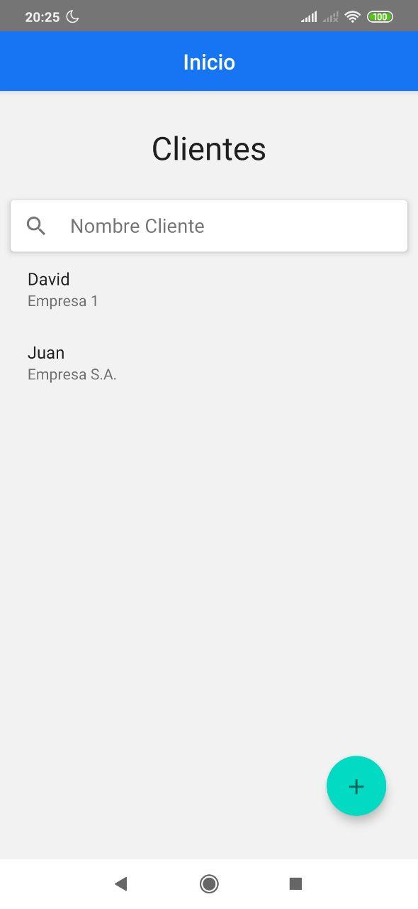
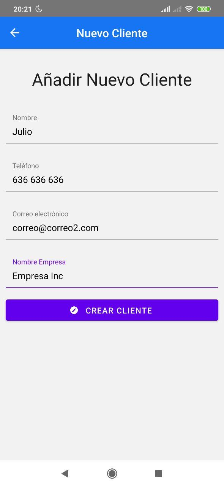
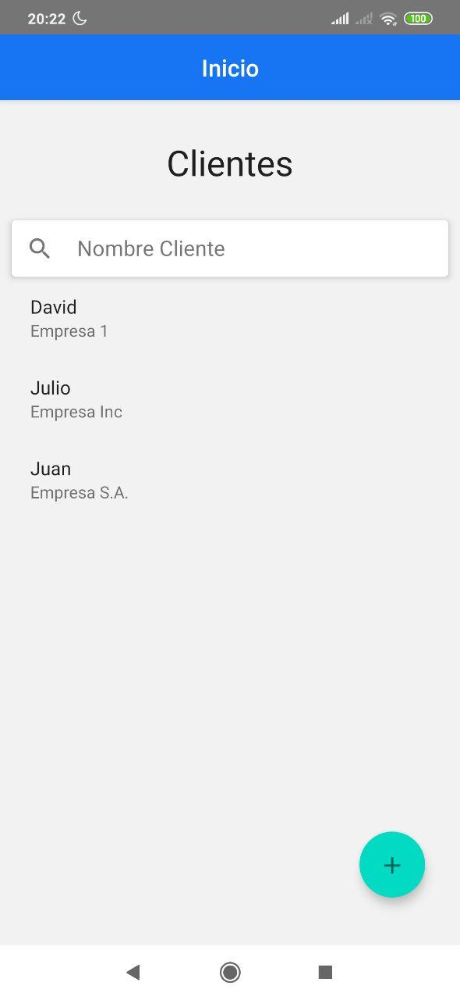
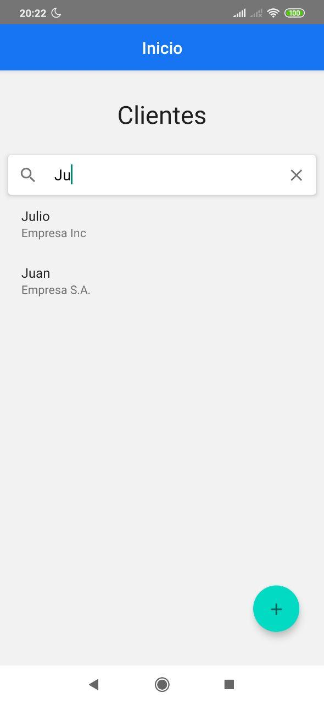
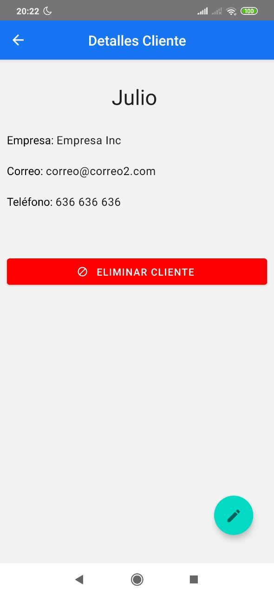
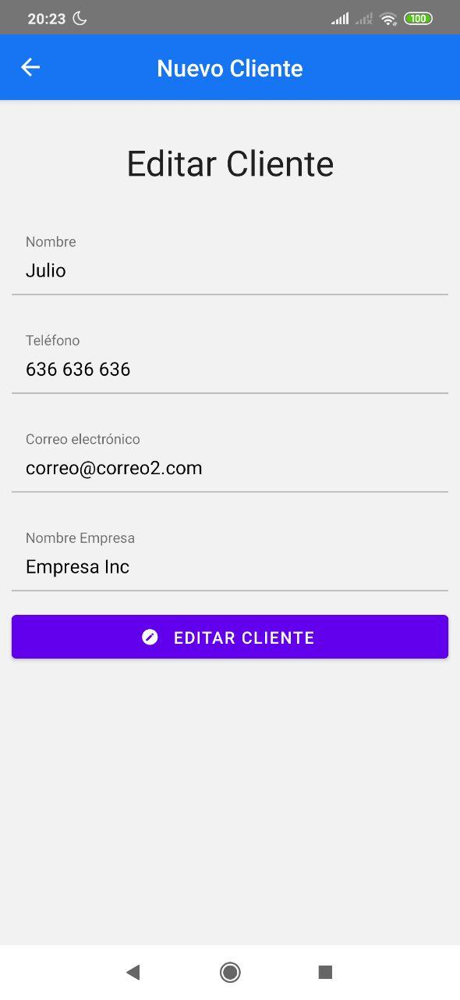

# Ejemplo básico de conexión a una API para hacer un CRUD Completo.

Simple aplicación para registrar a clientes. Estos son registrados en una base de datos mediante una (fake) API que corre con json-server. 

Contiene las acciones básicas de un CRUD (Create Read Update Read).

Se va a actualizar para que funcione con useReducer (el futuro de Redux integrado en React).

### Screens

